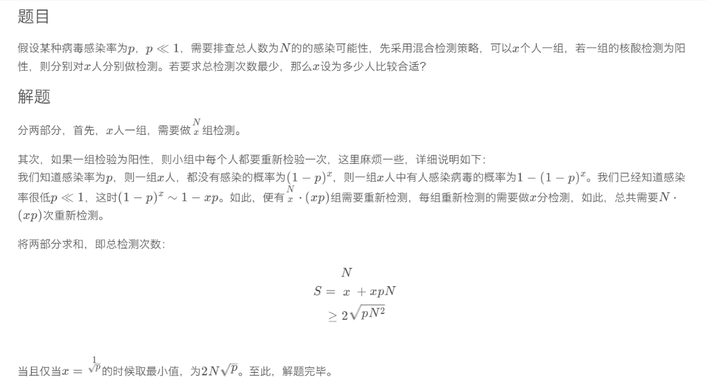

# 九坤面试题 
考核时间2h，22.4.1 0:20-2:20
## 第一部分 常识选择题 20分/4题
1. 12个小球，大小形状都相同，其中11个重量相同，1个轻了或重了，只有一个天平，问至少称几次才能找出重量不同的球？ 3次
2. 一柱香能燃 1h，现在有两柱香，请问一下哪个时间不能用这两柱香测量： d\
   a. 60min  b. 30min  c. 45min  d. 75min
3. 人群患新冠的概率为 0.01%，现要检测 1000万人，采取每x人一组的方式进行混合检测，若某一组成阳性，则分别对这x人进行检验，请问 x 取多少检验次数最少？ b\
   a. 50  b. 100  c. 80  d. 10
4. 小明知道同事家有两个孩子，但不知道男女，某一天去同事家看见其中一个孩子是男孩，请问另一个也是男孩的概率： 1/3

## 第二部分 逻辑填空题 30分/2题
1. a. 两个人骑摩托车出游，油桶相同，灌满后最多能走 100 公里，请问两人合作最多能走几公里？\
b. 若100个人一起骑摩托车出游，最多能走几公里？精确到小数点后两位

2. 一个10\*10的网格，若把左上角和右下角的1\*1的小格子抹掉，请问剩下的格子能被 1\*2 的网格完全覆盖吗？

## 第三部分 概率论数理统计/随机过程 30分/2题
1. a. 3个小朋友手拉手，每个小朋友可以自己拉自己的手，也可以拉其他小朋友的手（不区分左右手），请问3个小朋友环成1个圆圈的概率是：\
b. 若有 100 个小朋友手拉手，环成1个圆圈的概率是多少？

2. 54张扑克牌，不放回抽样，若抽X次时每张牌都至少出现一次，求E(X)，精确到两位小数

## 第四部分 算法编程题 20分/1题
接雨水\
给定 n 个非负整数表示每个宽度为 1 的柱子的高度图，计算按此排列的柱子，下雨之后能接多少雨水。

> leetcode上第42题，但删去了图片，示例改得不好理解\
示例1，输入：6，输出：0\
示例2，输入：56919，78972，29387，99791，79834，91273，12487，124097，12479，14979（总之是一堆很大且很长的数）
输出：（一个数，忘记了））

# 解析
## 一
### 1. 称小球

首先，把12个小球分成三等份，每份四只。
 
拿出其中两份放到天平两侧称（第一次） 

情况1：天平平衡
   那么那八个拿上去称的小球都是正常的，特殊的在四个里面。 
   把剩下四个小球拿出三个放到一边，另一边放三个正常的小球（第二次） 
   情况1-1：天平平衡
      特殊的是剩下的那个。从正常的里面取出任意一个和特殊的那个分别放在天平的两边，即知道特殊的那个球是轻是重了。（第三次）
   情况1-2：天平不平衡
      特殊的球在天平上面的那三个里，而且知道是重还是轻了。 
      从剩下三个中拿两个来称。（第三次）
   情况1-2-1天平平衡
      特殊的球是剩下的那个，而且也知道轻重了。
   情况1-2-2天平不平衡
      根据上面知道的特殊球的轻重特征就知道哪个是特殊球了。

情况2：天平不平衡 
   特殊的小球在放在天平上的那八个里面。 
   把重的一侧四个球记为A1A2A3A4，轻的记为B1B2B3B4。 
   剩下的确定为四个正常的记为C。 
   把A1B2B3B4放到一边，B1和三个正常的C小球放一边。（第二次） 

   情况2-1：天平平衡 
      特殊小球在A2A3A4里面，而且知道特殊小球比较重。 
      把A2A3称一下，就知道三个里面哪个是特殊的，也知道轻重了。（第三次） 

   情况2-2：天平不平衡，A1的那边比较重 
      特殊的小球在A1和B1之间。 
      随便拿一个和正常的称，就知道哪个特殊了，也知道轻重了。（第三次） 

   情况2-3：天平不平衡，B1那边比较重 
      特殊小球在B2B3B4中间，而且知道特殊小球比较轻。 
      把B2B3称一下，就知道哪个是特殊的了，也知道轻重了。（第三次）
   
### 2. 烧香

关于 30min：将一根线两头点着\
关于 45min：将甲香的一头点着，将乙香的两头点着，当乙香燃烧完时，说明已经过了半个小时，同时也说明甲香也正好燃烧了一半，此时，
将甲香的另一头点着，从此时起到甲香完全烧完，正好15分钟，加起来共 45 min。

### 3. 核酸检测

x = 1/sqrt(p) , p 为患病概率

截图自 https://wenku.baidu.com/view/8a14aa4c021ca300a6c30c22590102020740f21a.html

### 4. 男女概率

略

## 二